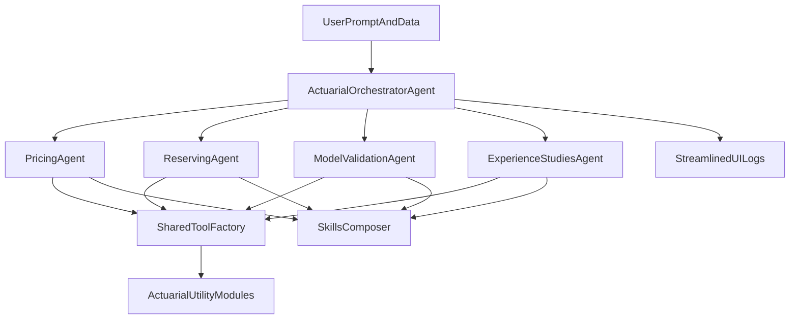

# Streamline and Enhance Actuarial Agent Suite

## Scope and outcomes
- Retain only four domain agents: pricing, reserving, model validation, and experience studies.
- Introduce an Agno-native orchestrator layer that routes user requests to the right specialist agent (or sequentially combines specialists when needed).
- Upgrade skills handling so system prompts consistently encode senior-actuary behavior and role-specific guardrails.
- Add reusable actuarial utility modules for common analysis operations used across agents.
- Streamline activity logs for clear user visibility in Streamlit (without external persistence).

## Target architecture

## Reusable advanced patterns from this repo
- **Coordinator plus staged delegation (highest value)**
  - Borrow the coordinator pattern used in [`/Users/rohanyashraj/Documents/GitHub/awesome-llm-apps/advanced_ai_agents/multi_agent_apps/agent_teams/ai_vc_due_diligence_agent_team/agent.py`](/Users/rohanyashraj/Documents/GitHub/awesome-llm-apps/advanced_ai_agents/multi_agent_apps/agent_teams/ai_vc_due_diligence_agent_team/agent.py) and [`/Users/rohanyashraj/Documents/GitHub/awesome-llm-apps/advanced_ai_agents/multi_agent_apps/ai_home_renovation_agent/agent.py`](/Users/rohanyashraj/Documents/GitHub/awesome-llm-apps/advanced_ai_agents/multi_agent_apps/ai_home_renovation_agent/agent.py): one root router, specialized child agents, and optional sequential pipelines for complex requests.
  - Apply to actuarial flow as: `route -> specialist_run -> optional_validation_pass -> merged_memo`.

- **Graph-like quality gate for retrieval-heavy tasks**
  - Reuse the graded-retrieval and rewrite concepts from [`/Users/rohanyashraj/Documents/GitHub/awesome-llm-apps/rag_tutorials/ai_blog_search/app.py`](/Users/rohanyashraj/Documents/GitHub/awesome-llm-apps/rag_tutorials/ai_blog_search/app.py) and [`/Users/rohanyashraj/Documents/GitHub/awesome-llm-apps/rag_tutorials/corrective_rag/corrective_rag.py`](/Users/rohanyashraj/Documents/GitHub/awesome-llm-apps/rag_tutorials/corrective_rag/corrective_rag.py).
  - Keep Agno orchestration, but add a lightweight decision step inside orchestrator prompts: if data quality/relevance is low, reformulate request and rerun once.

- **Tool hooks for observability and consistency**
  - Use the tool hook style from [`/Users/rohanyashraj/Documents/GitHub/awesome-llm-apps/advanced_ai_agents/multi_agent_apps/agent_teams/ai_travel_planner_agent_team/backend/tools/google_flight.py`](/Users/rohanyashraj/Documents/GitHub/awesome-llm-apps/advanced_ai_agents/multi_agent_apps/agent_teams/ai_travel_planner_agent_team/backend/tools/google_flight.py) and its logger helper in [`/Users/rohanyashraj/Documents/GitHub/awesome-llm-apps/advanced_ai_agents/multi_agent_apps/agent_teams/ai_travel_planner_agent_team/backend/config/logger.py`](/Users/rohanyashraj/Documents/GitHub/awesome-llm-apps/advanced_ai_agents/multi_agent_apps/agent_teams/ai_travel_planner_agent_team/backend/config/logger.py).
  - Adapt for actuarial tools by capturing normalized `tool_name`, `inputs_summary`, `duration_ms`, and `result_preview` into Streamlit activity logs.

- **Agent profile catalog to reduce UI wiring duplication**
  - Follow the catalog pattern in [`/Users/rohanyashraj/Documents/GitHub/awesome-llm-apps/mcp_ai_agents/multi_mcp_agent_router/agent_forge.py`](/Users/rohanyashraj/Documents/GitHub/awesome-llm-apps/mcp_ai_agents/multi_mcp_agent_router/agent_forge.py): central map of agent metadata and capabilities.
  - Add a local `agent_profiles.py` for the 4 retained agents to hold model id, skill stack, tool policy, and display label; `app_streamlit.py` should render from this profile map.

- **Programmatic guardrails plus recovery path**
  - Draw from validator/retry pattern in [`/Users/rohanyashraj/Documents/GitHub/awesome-llm-apps/rag_tutorials/agentic_rag_math_agent/rag/query_router.py`](/Users/rohanyashraj/Documents/GitHub/awesome-llm-apps/rag_tutorials/agentic_rag_math_agent/rag/query_router.py).
  - Add minimal runtime checks (scope, missing assumptions, contradictory conclusions) and one guarded retry with stricter instructions before final output.

## File-level implementation plan
- **Constrain to four agents and remove extra UI/workflows**
  - Update imports, tabs, and run flow in [`/Users/rohanyashraj/Documents/GitHub/awesome-llm-apps/actuarial_agents_suite/app_streamlit.py`](/Users/rohanyashraj/Documents/GitHub/awesome-llm-apps/actuarial_agents_suite/app_streamlit.py) to keep only pricing/reserving/model validation/experience studies.
  - Remove pension/IFRS/research references from [`/Users/rohanyashraj/Documents/GitHub/awesome-llm-apps/actuarial_agents_suite/README.md`](/Users/rohanyashraj/Documents/GitHub/awesome-llm-apps/actuarial_agents_suite/README.md), [`/Users/rohanyashraj/Documents/GitHub/awesome-llm-apps/actuarial_agents_suite/ui_branding.py`](/Users/rohanyashraj/Documents/GitHub/awesome-llm-apps/actuarial_agents_suite/ui_branding.py), and fixture docs.
  - Update smoke tests to reflect only four factories in [`/Users/rohanyashraj/Documents/GitHub/awesome-llm-apps/actuarial_agents_suite/tests/test_smoke.py`](/Users/rohanyashraj/Documents/GitHub/awesome-llm-apps/actuarial_agents_suite/tests/test_smoke.py).

- **Add Agno-native orchestrator**
  - Create a new orchestration module (e.g., [`/Users/rohanyashraj/Documents/GitHub/awesome-llm-apps/actuarial_agents_suite/agents/orchestrator_agent.py`](/Users/rohanyashraj/Documents/GitHub/awesome-llm-apps/actuarial_agents_suite/agents/orchestrator_agent.py)) that:
    - Classifies intent to one of the 4 specialists.
    - Handles multi-domain prompts via staged delegation (e.g., reserving + validation).
    - Applies a single quality-gate reroute when assumptions/data relevance are weak.
    - Returns concise routing rationale and merged final answer.
  - Integrate orchestrator-first execution in Streamlit so users interact through a single entry path while preserving optional direct specialist tabs.
  - Add `agent_profiles.py` as a central profile catalog to configure routing targets and keep UI wiring declarative.

- **Robust skills framework for senior-actuary behavior**
  - Evolve [`/Users/rohanyashraj/Documents/GitHub/awesome-llm-apps/actuarial_agents_suite/skills_loader.py`](/Users/rohanyashraj/Documents/GitHub/awesome-llm-apps/actuarial_agents_suite/skills_loader.py) into a central composer with:
    - Deterministic skill stacks per agent role.
    - Shared “experienced actuary” base instruction block (assumption disclosure, materiality checks, sensitivity mindset, governance language).
    - Strict/lenient missing-skill policy applied consistently (not only in reserving).
  - Add a dedicated base skill artifact (e.g., `skills/actuarial-senior-practice/SKILL.md`) and reference it across all retained agents.
  - Refactor retained agent factories to use one standardized prompt-composition path.

- **Provide actuarial utility files**
  - Add reusable utility modules (e.g., [`/Users/rohanyashraj/Documents/GitHub/awesome-llm-apps/actuarial_agents_suite/actuarial_utils/triangle.py`](/Users/rohanyashraj/Documents/GitHub/awesome-llm-apps/actuarial_agents_suite/actuarial_utils/triangle.py), [`/Users/rohanyashraj/Documents/GitHub/awesome-llm-apps/actuarial_agents_suite/actuarial_utils/metrics.py`](/Users/rohanyashraj/Documents/GitHub/awesome-llm-apps/actuarial_agents_suite/actuarial_utils/metrics.py), [`/Users/rohanyashraj/Documents/GitHub/awesome-llm-apps/actuarial_agents_suite/actuarial_utils/validation.py`](/Users/rohanyashraj/Documents/GitHub/awesome-llm-apps/actuarial_agents_suite/actuarial_utils/validation.py)) for common tasks:
    - Triangle shaping and development factor helpers.
    - Loss ratio / trend / rate adequacy summaries.
    - Input and assumption validation helpers.
  - Keep functions pure and testable; avoid Streamlit coupling.

- **Appropriate tool calls and shared tool factory**
  - Introduce a shared tool-construction helper (e.g., [`/Users/rohanyashraj/Documents/GitHub/awesome-llm-apps/actuarial_agents_suite/tools/factory.py`](/Users/rohanyashraj/Documents/GitHub/awesome-llm-apps/actuarial_agents_suite/tools/factory.py)) used by agent factories and Streamlit run setup.
  - Standardize when each agent gets DuckDB/Pandas tools vs text-only operation (especially model validation).
  - Add lightweight actuarial helper tools (read-only calculations/checks) surfaced to agents where beneficial.
  - Implement shared tool hooks to emit consistent tool-call telemetry into existing UI logs.

- **Streamline activity logs (UI-first)**
  - Refine event formatting and grouping in [`/Users/rohanyashraj/Documents/GitHub/awesome-llm-apps/actuarial_agents_suite/agent_run_ui.py`](/Users/rohanyashraj/Documents/GitHub/awesome-llm-apps/actuarial_agents_suite/agent_run_ui.py):
    - Collapse noisy events.
    - Add consistent step labels (`route`, `tool_call`, `analysis`, `final_answer`).
    - Improve argument/result truncation readability.
    - Include hook-derived per-tool duration and concise input/output summaries.
  - Update Streamlit log rendering in [`/Users/rohanyashraj/Documents/GitHub/awesome-llm-apps/actuarial_agents_suite/app_streamlit.py`](/Users/rohanyashraj/Documents/GitHub/awesome-llm-apps/actuarial_agents_suite/app_streamlit.py) with cleaner live updates and optional downloadable plain-text run log.

## Validation and acceptance checks
- Unit/smoke tests pass for retained factories and new orchestrator routing behavior.
- No references remain in UI/docs/tests to pension, IFRS, or research agents.
- Each retained agent uses standardized skill composition with senior-actuary base guidance.
- Shared utilities are covered by focused tests and consumed by tools/agents.
- Run logs are shorter, phase-structured, and easier to scan in Streamlit.